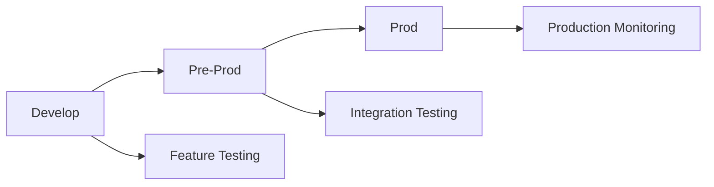

# BMG Agent Gateway Umbrella Chart

## Introduction

The BMG Agent Gateway is implemented as a Helm umbrella chart, which is a best practice for deploying complex, multi-component applications. An umbrella chart allows you to manage and deploy multiple related components as a single release while maintaining separation of concerns and modularity.

### What is an Umbrella Chart?

An umbrella chart is a Helm chart that contains other charts (subcharts) as dependencies. Instead of having all Kubernetes manifests in a single monolithic chart, the umbrella chart orchestrates the deployment of multiple specialized subcharts. This approach provides:

- **Modularity**: Each component can be developed, tested, and versioned independently
- **Reusability**: Subcharts can be reused in other umbrella charts
- **Maintainability**: Easier to manage complex applications with multiple services
- **CI/CD Ready**: Better suited for automated deployment pipelines

### Chart Structure

```
bmg-agent-gateway/
├── Chart.yaml              # Umbrella chart metadata and dependencies
├── values.yaml             # Global configuration values
├── templates/              # Shared templates (Gateway, Policy)
│   ├── _helpers.tpl        # Shared helper functions
│   ├── gateway-policy.yaml # Authentication policy
│   └── NOTES.txt           # Post-installation notes
└── charts/                 # Subcharts directory
    ├── agent/              # Agent subchart
    │   ├── Chart.yaml
    │   ├── values.yaml
    │   └── templates/
    ├── ui/                 # UI subchart
    │   ├── Chart.yaml
    │   ├── values.yaml
    │   └── templates/
    ├── mcp-hubspot/        # MCP HubSpot subchart
    │   ├── Chart.yaml
    │   ├── values.yaml
    │   └── templates/
    └── mcp-mssql/          # MCP MSSQL subchart
        ├── Chart.yaml
        ├── values.yaml
        └── templates/
```

### Components

1. **Agent**: Core orchestration service that manages MCP server connections
2. **UI**: Web interface for user interaction with the agent system
3. **MCP HubSpot**: MCP server providing HubSpot CRM integration
4. **MCP MSSQL**: MCP server providing Microsoft SQL Server database access
5. **Gateway**: Routes traffic between components and enforces authentication
6. **Policy**: Azure AD authentication policy for secure access

## Prerequisites

Before running the umbrella chart, ensure your Kubernetes cluster meets these requirements:

### Kubernetes Version
- Kubernetes 1.19 or higher

### Helm Version
- Helm 3.0 or higher

### Required Controllers and APIs
- **Gateway API**: Install Gateway API CRDs
  ```bash
  kubectl apply -f https://github.com/kubernetes-sigs/gateway-api/releases/download/v1.0.0/standard-install.yaml
  ```
- **Agent Gateway Controller**: Install the Agent Gateway CRDs and controller
  ```bash
  helm upgrade --install agentgateway-crds \
      oci://cr.agentgateway.dev/charts/agentgateway-crds \
      --version v2.2.0-beta.4 \
      --namespace "${AGENTGATEWAY_NAMESPACE}" \
      --create-namespace

  helm upgrade --install agentgateway \
      oci://cr.agentgateway.dev/charts/agentgateway \
      --version v2.2.0-beta.4 \
      --namespace "${AGENTGATEWAY_NAMESPACE}" \
      --create-namespace
  ```

### External Dependencies
- Azure AD application registration
- MSSQL database server
- HubSpot API access

## Quick Deployment Commands

For quick reference, here are the deployment commands for each environment:

### Development Environment
```bash
helm dependency update
helm upgrade --install bmg-develop . \
  -f values.yaml \
  -f develop.yaml
```

### Pre-Production Environment
```bash
helm dependency update
helm upgrade --install bmg-pre-prod . \
  -f values.yaml \
  -f pre-prod.yaml
```

### Production Environment
```bash
helm dependency update
helm upgrade --install bmg-prod . \
  -f values.yaml \
  -f prod.yaml
```

**Note**: These commands deploy to their respective namespaces (`bmg-develop`, `bmg-pre-prod`, `bmg-prod`) automatically based on the namespace configuration in each environment file.

## Recent Configuration Changes

### Global Configuration Updates

Recent updates have been made to improve configuration management across environments:

1. **Namespace Configuration**: The `namespace` setting has been moved to the `global` section in `develop.yaml` to ensure all subcharts deploy to the correct namespace. This fixes deployment issues where resources were incorrectly placed in the `default` namespace.

2. **Azure Authentication**: Azure Client ID and Tenant ID configurations have been moved to the `global.azure` section to make them accessible to all subcharts, particularly the UI component for authentication.

3. **Template Updates**: All Helm templates have been updated to reference `.Values.global.namespace` and `.Values.global.azure.*` instead of local values, ensuring consistent configuration inheritance.

### Configuration Structure

The current configuration hierarchy is:
- `values.yaml`: Base configuration shared across environments
- `global` section: Environment-agnostic settings (namespace, azure config, etc.)
- Environment files (`develop.yaml`, `pre-prod.yaml`, `prod.yaml`): Environment-specific overrides

### Environment Promotion Alignment

The configurations now properly follow the environment promotion workflow:

- **Develop**: 1 replica per component, development tags, `bmg-develop` namespace
- **Pre-Prod**: 2 replicas per component for HA testing, `bmg-pre-prod` namespace
- **Prod**: 3 replicas per component for production HA, stable configs, `bmg-prod` namespace

### Subchart Naming Convention Fix

Fixed subchart value key names to match Helm dependency names:
- `mcpHubspot` → `mcp-hubspot`
- `mcpMssql` → `mcp-mssql`

This ensures replica scaling works correctly for all MCP components.

### Deployment Impact

These changes ensure that:
- All components deploy to the correct namespace per environment
- Azure authentication works properly in the UI
- Configuration is consistent across all subcharts
- Manual deployments work without specifying `--namespace` flags
- Resource scaling follows the promotion workflow (1→2→3 replicas)

## Installation and Deployment

The BMG Agent Gateway umbrella chart supports deployment to multiple environments using the `values.yaml` + environment-specific configuration approach. This provides clean separation between environments while maintaining consistent base configurations.

### Environment-Specific Deployment

The chart automatically deploys to the namespace specified in the environment configuration files. If no environment file is provided, resources deploy to the `default` namespace.

#### 1. Development Environment

**Configuration**: Uses `develop.yaml` with minimal resources and latest images. Deploys to `bmg-develop` namespace.

```bash
# Option 1: Using the deployment script (recommended)
./deploy.sh develop

# Option 2: Manual Helm commands
helm dependency update
helm upgrade --install bmg-develop . \
  -f values.yaml \
  -f develop.yaml \
  --wait

# Option 3: Dry run for validation
./deploy.sh develop --dry-run

# Option 4: Manual dry run
helm template bmg-develop . \
  -f values.yaml \
  -f develop.yaml
```

**Note**: The `--namespace` flag is not needed in manual commands when using environment files, as the namespace is automatically set from the configuration.

**Development Environment Features**:
- Single replicas for all components
- Latest Docker images
- Minimal resource requests
- Development database connections
- Fast deployment for testing

#### 2. Pre-Production Environment

**Configuration**: Uses `pre-prod.yaml` with moderate resources and release candidate images. Deploys to `bmg-pre-prod` namespace.

```bash
# Using the deployment script
./deploy.sh pre-prod

# Or manual commands
helm dependency update
helm upgrade --install bmg-pre-prod . \
  -f values.yaml \
  -f pre-prod.yaml \
  --wait
```

**Pre-Production Environment Features**:
- Dual replicas for high availability testing
- Release candidate images (e.g., `v1.2.3-rc.1`)
- Staging database connections
- Moderate resource allocations
- Pre-production validation

#### 3. Production Environment

**Configuration**: Uses `prod.yaml` with full production resources and stable images. Deploys to `bmg-prod` namespace.

```bash
# Using the deployment script (recommended)
./deploy.sh prod

# Or manual commands
helm dependency update
helm upgrade --install bmg-prod . \
  -f values.yaml \
  -f prod.yaml \
  --wait \
  --timeout 900s
```

**Note**: Ensure all production secrets and configurations are properly set in `prod.yaml` before deployment. The deployment will create resources in the `bmg-prod` namespace with high availability settings (3 replicas for critical components).

**Production Environment Features**:
- Triple replicas for high availability
- Stable release images (e.g., `v1.2.3`)
- Production database connections
- Full resource allocations
- Enhanced monitoring and security

### 4. Verify Installation

After deployment, verify that all components are running correctly:

```bash
# Check deployment status (replace with your environment)
ENV="develop"  # or "pre-prod" or "prod"
NAMESPACE="bmg-$ENV"

# Check all pods
kubectl get pods -n $NAMESPACE

# Check services
kubectl get svc -n $NAMESPACE

# Check gateway and routes
kubectl get gateway,httproute -n $NAMESPACE

# Check custom resources
kubectl get agentgatewaybackend,agentgatewaypolicy -n $NAMESPACE

# View logs if needed
kubectl logs -n $NAMESPACE deployment/bmg-agent
kubectl logs -n $NAMESPACE deployment/bmg-ui
```

### 5. Access the Application

Once deployed, access the application through the Gateway:

```bash
# Get the Gateway service (adjust namespace)
kubectl get svc -n bmg-develop agentgateway-proxy

# Port forward for local access
kubectl port-forward -n bmg-develop svc/agentgateway-proxy 8080:8080

# Access URLs:
# UI: http://localhost:8080/ui
# API: http://localhost:8080/api
# MCP HubSpot: http://localhost:8080/mcp/mcp-hubspot
# MCP MSSQL: http://localhost:8080/mcp/mcp-mssql
```

### 6. Environment Promotion Workflow

Follow this workflow to promote changes through environments:



## Environment Promotion Process

### Promotion Steps

1. **Develop → Pre-Prod**: After successful development testing
2. **Pre-Prod → Prod**: After integration testing and approval
3. **Continuous Monitoring**: Monitor production deployments

### Detailed Promotion Guide

#### Phase 1: Development Testing
```bash
# Deploy to develop environment
./deploy.sh develop

# Or manual deployment
helm dependency update
helm upgrade --install bmg-develop . \
  -f values.yaml \
  -f develop.yaml

# Perform feature testing in develop
# - Unit tests
# - Component integration tests
# - Basic functionality validation
```

#### Phase 2: Pre-Production Testing (Parallel with Development)
```bash
# While keeping develop environment for ongoing development,
# promote stable changes to pre-prod for integration testing

# Deploy to pre-prod environment
./deploy.sh pre-prod

# Or manual deployment
helm dependency update
helm upgrade --install bmg-pre-prod . \
  -f values.yaml \
  -f pre-prod.yaml

# Perform integration testing in pre-prod
# - End-to-end tests
# - Performance testing
# - Load testing with 2 replicas
# - External system integration
```

#### Phase 3: Production Deployment
```bash
# After pre-prod testing passes and approval is received

# Deploy to production
./deploy.sh prod

# Or manual deployment
helm dependency update
helm upgrade --install bmg-prod . \
  -f values.yaml \
  -f prod.yaml \
  --wait \
  --timeout 900s

# Verify production deployment
kubectl get pods -n bmg-prod
kubectl get svc -n bmg-prod
```

### Simultaneous Testing Strategy

**Development Environment** (Ongoing Development):
- Used for active development and feature work
- Latest code changes
- Single replicas for cost efficiency
- May have breaking changes

**Pre-Production Environment** (Staging):
- Stable releases ready for production
- Integration testing with production-like data
- Dual replicas for HA validation
- Mirrors production configuration

**Benefits of Parallel Testing**:
- Development can continue while pre-prod is tested
- Faster feedback loops
- Reduced risk of breaking changes in production
- Separate environments for different testing phases

### Promotion Checklist

#### Pre-Promotion (Develop → Pre-Prod)
- [ ] All unit tests pass
- [ ] Feature testing completed
- [ ] Code review approved
- [ ] No critical security issues
- [ ] Documentation updated

#### Pre-Promotion (Pre-Prod → Prod)
- [ ] Integration tests pass
- [ ] Performance benchmarks met
- [ ] Load testing successful
- [ ] Business approval received
- [ ] Rollback plan documented
- [ ] Monitoring alerts configured

### Rollback Procedures

If issues are discovered after promotion:

```bash
# Immediate rollback to previous version
helm rollback bmg-prod -n bmg-prod

# Or redeploy specific version
helm upgrade bmg-prod ./chart-backup-v1.2.2 \
  -f values.yaml \
  -f prod.yaml \
  -n bmg-prod
```

### Best Practices

1. **Version Control**: Tag releases in Git before promotion
2. **Automated Testing**: Run full test suite before each promotion
3. **Gradual Rollouts**: Consider canary deployments for high-risk changes
4. **Monitoring**: Set up alerts for key metrics post-deployment
5. **Documentation**: Maintain deployment logs and change records

### 7. Troubleshooting Deployment Issues

#### Common Issues and Solutions

**Chart Dependency Issues**:
```bash
# Update dependencies
helm dependency update

# Check dependency status
helm dependency list
```

**Namespace Conflicts**:
```bash
# Check existing namespaces
kubectl get namespaces

# Clean up if needed
helm uninstall bmg-develop -n bmg-develop
kubectl delete namespace bmg-develop
```

**Resource Quota Issues**:
```bash
# Check resource quotas
kubectl describe resourcequota -n bmg-prod

# Check pod resource usage
kubectl top pods -n bmg-prod
```

**Image Pull Issues**:
```bash
# Check image pull secrets
kubectl get secrets -n bmg-develop

# Verify image names and tags
kubectl describe pod <pod-name> -n bmg-develop
```

### 8. Updating Deployments

To update an existing deployment with new configurations:

```bash
# Update dependencies (if chart versions changed)
helm dependency update

# Upgrade specific environment
./deploy.sh develop

# Or upgrade with specific values
helm upgrade bmg-develop . \
  -f values.yaml \
  -f develop.yaml
```

### 9. Backup and Recovery

**Configuration Backup**:
```bash
# Backup current values
helm get values bmg-prod > prod-values-backup.yaml

# Backup secrets (use caution)
kubectl get secrets -n bmg-prod -o yaml > secrets-backup.yaml
```

**Emergency Rollback**:
```bash
# Rollback to previous release
helm rollback bmg-prod -n bmg-prod

# Or redeploy previous version
helm upgrade bmg-prod ./backup-chart-v1.2.2 \
  -f values.yaml \
  -f prod.yaml
```


## Subchart Management

### Updating Subcharts

To update a specific subchart:

```bash
# Update dependencies
helm dependency update

# Upgrade the release
helm upgrade my-release . -f values.yaml
```

### Overriding Subchart Values

You can override subchart values in the umbrella chart's `values.yaml`:

```yaml
# Override agent replica count
agent:
  deployment:
    replicas: 3

# Disable a subchart (if supported)
mcp-hubspot:
  enabled: false
```

### Developing Subcharts

For development, you can install subcharts individually:

```bash
# Install only the agent subchart
helm install agent-test ./charts/agent -f agent-values.yaml
```

## Best Practices

### 1. Value Inheritance
- Use the umbrella chart's `values.yaml` for global configuration
- Subcharts should have sensible defaults
- Avoid hardcoding values in templates

### 2. Naming Conventions
- Use consistent naming across subcharts
- Leverage Helm's built-in naming helpers
- Include release name in resource names for multi-tenancy

### 3. Dependency Management
- Keep subchart versions in sync with main chart
- Use version ranges for flexibility
- Test upgrades thoroughly

### 4. Resource Separation
- Each resource type in separate template files
- Use `---` separators if multiple resources per file (not recommended)
- Group related resources logically

### 5. CI/CD Integration
- Use `helm dependency update` in pipelines
- Validate with `helm lint` and `helm template`
- Test installations in staging environments

## Troubleshooting

### Common Issues

1. **Subchart Not Found**: Run `helm dependency update`
2. **Value Conflicts**: Check for duplicate keys in values files
3. **Resource Conflicts**: Ensure unique names across subcharts
4. **Dependency Issues**: Verify subchart versions and compatibility

### Debugging Commands

```bash
# List dependencies
helm dependency list

# Render templates with debug
helm template my-release . --debug

# Check release status
helm status my-release

# View release values
helm get values my-release
```

## Migration from Monolithic Chart

If migrating from a monolithic chart:

1. Extract component manifests into subcharts
2. Create separate `values.yaml` for each subchart
3. Update the umbrella chart to reference subcharts
4. Test thoroughly in staging
5. Update CI/CD pipelines

## Advanced Configuration

For advanced deployment scenarios, CI/CD integration, and multi-environment management strategies, consider the following approaches:

### GitOps Integration
- Use ArgoCD or Flux for declarative deployments
- Implement automated testing and promotion pipelines
- Set up environment-specific configurations with proper isolation

### CI/CD Pipelines
- Validate charts with `helm lint` and `helm template`
- Test deployments in staging environments before production
- Implement automated rollbacks for failed deployments

### Monitoring and Observability
- Monitor pod health and resource usage across environments
- Set up alerts for deployment failures and performance issues
- Implement logging aggregation for troubleshooting

### Security Best Practices
- Use external secret management (Vault, AWS Secrets Manager)
- Implement RBAC for environment-specific access
- Enable network policies and TLS in production environments

## References

- [Helm Umbrella Charts Best Practices](https://www.un4uthorized.com/articles/umbrella-charts)
- [Helm Chart Dependencies](https://helm.sh/docs/helm/helm_dependency/)
- [Subcharts and Globals](https://helm.sh/docs/chart_template_guide/subcharts_and_globals/)
- [Gateway API](https://gateway-api.sigs.k8s.io/)
- [Agent Gateway](https://agentgateway.dev/)
